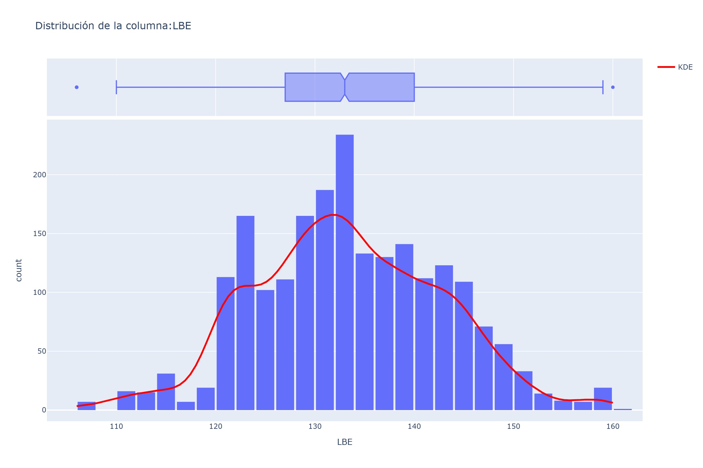
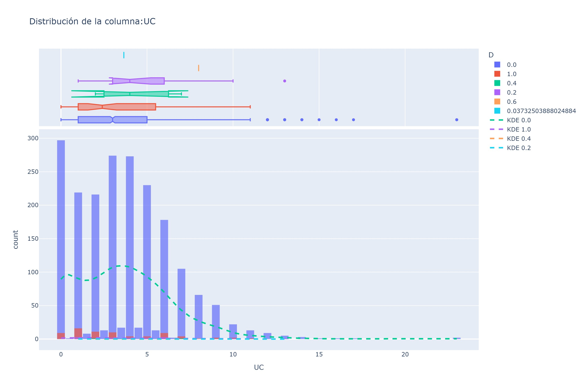
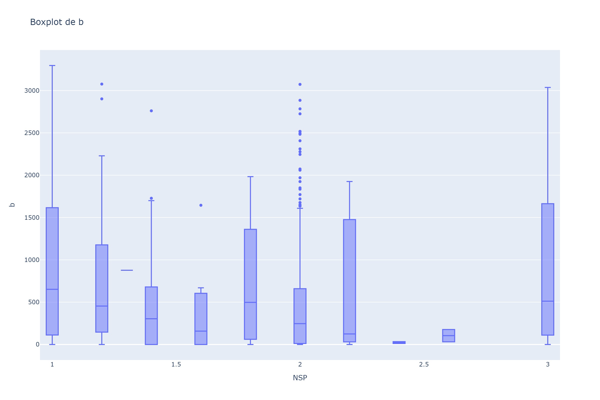
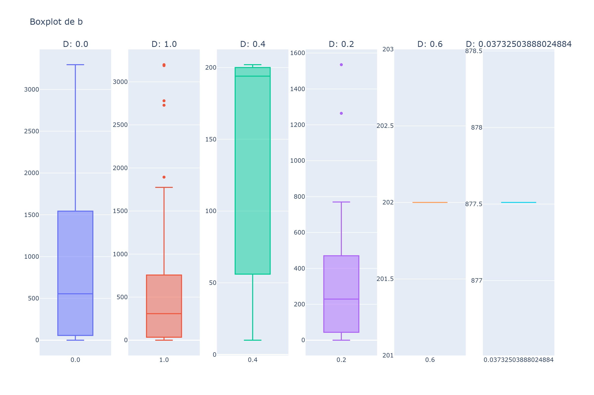
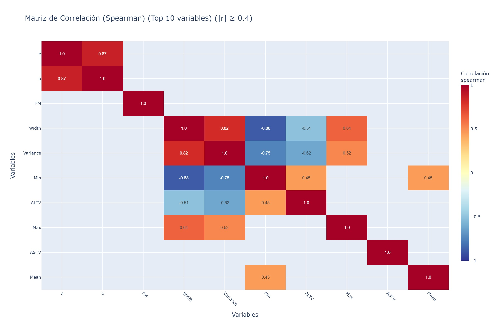
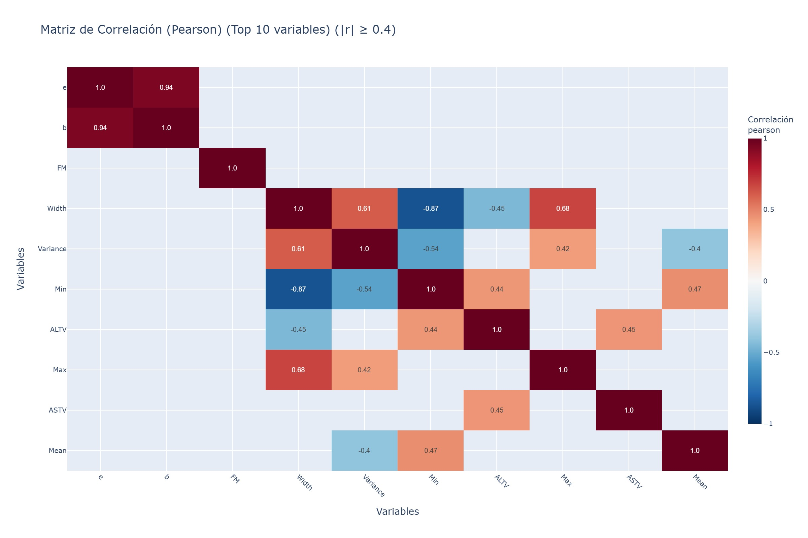

# 📊 Ciencia de Datos - Práctica 3: Análisis Exploratorio

## 📝 Descripción del Proyecto

Este proyecto implementa una **librería personalizada de análisis exploratorio de datos** con funciones especializadas para preprocesamiento, visualización interactiva y análisis estadístico. La librería está diseñada para facilitar el análisis de datos médicos, específicamente datos de cardiotocografía (CTG), pero es aplicable a cualquier conjunto de datos.

## 🎯 Objetivos

- Crear una librería reutilizable para análisis exploratorio de datos
- Implementar visualizaciones interactivas con Plotly
- Aplicar técnicas de preprocesamiento y limpieza de datos
- Proporcionar análisis estadístico automatizado
- Documentar código siguiendo estándares profesionales (NumPy docstring)

## 🏗️ Estructura del Proyecto

```
ciencia_datos_practica3/
├── 📁 libreria_modulo_1/          # Librería personalizada
│   ├── __init__.py                # Configuración del módulo
│   ├── analysis.py                # Análisis estadístico
│   ├── preprocessing.py           # Preprocesamiento de datos
│   └── visualization.py           # Visualizaciones interactivas
├── 📊 CTG.csv                     # Dataset de cardiotocografía
├── 📓 practica3.ipynb            # Notebook principal
├── 📋 requirements.txt            # Dependencias del proyecto
└── 📖 README.md                   # Este archivo
```

## 🚀 Instalación

### Prerrequisitos
- Python 3.12 o superior
- pip (gestor de paquetes de Python)

### Pasos de instalación

1. **Clonar el repositorio:**
```bash
git clone https://github.com/somexav/ciencia_datos_practica3.git
cd ciencia_datos_practica3
```

2. **Instalar dependencias:**
```bash
pip install -r requirements.txt
```

3. **Verificar instalación:**
```python
import libreria_modulo_1 as lm1
print("✅ Librería instalada correctamente")
```

4. **Ejecutar pruebas unitarias:**
```bash
# Ejecutar todas las pruebas
python test_libreria_modulo_1.py

# O usar pytest si está instalado
pytest test_libreria_modulo_1.py -v
```

## 🧪 Pruebas Unitarias

El proyecto incluye **4 pruebas unitarias específicas** para las funciones clave del módulo de preprocesamiento:

### 📋 Cobertura de Pruebas

| Función | Descripción de la Prueba | Validaciones |
|---------|-------------------------|--------------|
| **`agrega_nan()`** | Agregar valores NaN aleatoriamente | ✅ Tipo de retorno, forma del DataFrame, reproducibilidad con seed |
| **`delete_missing_values()`** | Eliminar columnas con exceso de NaN | ✅ Eliminación correcta de columnas, preservación de datos válidos |
| **`impute_missing_values()`** | Imputar valores faltantes | ✅ Eliminación completa de NaN, preservación de estructura |
| **`detect_outliers_iqr()`** | Detectar outliers con método IQR | ✅ Estructura del resultado, detección correcta de outliers |

### 🎯 Tipos de Validaciones

1. **Funcionalidad Básica**: Verificación de que cada función ejecuta correctamente
2. **Tipos de Retorno**: Validación de que devuelven el tipo de datos esperado  
3. **Integridad de Datos**: Preservación de estructura y contenido válido
4. **Casos Específicos**: Validación de comportamientos particulares de cada función

### 🚀 Ejecutar las Pruebas

```bash
# Ejecutar las 4 pruebas con reporte detallado
python test_libreria_modulo_1.py

# Resultado esperado:
# 🧪 PRUEBAS UNITARIAS - MÓDULO PREPROCESSING
# ✅ 4 pruebas ejecutadas exitosamente
# 🔬 Las 4 funciones clave funcionan correctamente
```

### 📊 Estadísticas de Pruebas

- **Total de pruebas**: 4 (enfocadas en preprocesamiento)
- **Funciones cubiertas**: 4/6 funciones del módulo preprocessing
- **Tiempo de ejecución**:  30 segundos
- **Cobertura**: Funciones más críticas del flujo de trabajo

## 📚 Documentación de la Librería

### 🔧 Módulo `preprocessing`

Funciones especializadas para limpieza y preprocesamiento de datos:

| Función | Descripción | Uso Principal |
|---------|-------------|---------------|
| `agrega_nan()` | Simula valores faltantes aleatoriamente | Testing y simulación |
| `delete_missing_values()` | Elimina columnas con exceso de valores nulos | Limpieza de datos |
| `impute_missing_values()` | Imputa valores faltantes con múltiples métodos | Completitud de datos |
| `detect_outliers_iqr()` | Detecta outliers usando método IQR | Análisis de calidad |
| `detect_outliers_zscore()` | Detecta outliers usando Z-Score | Análisis estadístico |
| `remove_outliers()` | Elimina outliers del dataset | Limpieza de datos |

**Ejemplo de uso:**
```python
import libreria_modulo_1 as lb

# Imputar valores faltantes
df_clean = lb.impute_missing_values(df, method='knn')

# Detectar outliers
outliers_info = lb.detect_outliers_iqr(df, factor=1.5)
```

### 📊 Módulo `visualization`

Visualizaciones interactivas con Plotly para análisis exploratorio:

| Función | Tipo de Gráfico | Casos de Uso |
|---------|-----------------|--------------|
| `plot_interactive_histogram()` | Histograma + KDE | Distribución de variables continuas |
| `plot_interactive_boxplot()` | Boxplot interactivo | Comparación entre grupos |
| `plot_interactive_bar_horizontal()` | Barras horizontales | Variables categóricas |
| `plot_interactive_line_timeseries()` | Serie temporal | Tendencias temporales |
| `plot_interactive_dot_comparison()` | Dot plot | Comparación de dos grupos |
| `plot_interactive_density_multiclass()` | Curvas de densidad | Distribuciones por clase |
| `plot_interactive_violin_swarm()` | Gráfico de violín | Distribución y densidad |
| `plot_interactive_correlation_heatmap()` | Heatmap de correlación | Relaciones entre variables |

**Ejemplo de uso:**
```python
# Crear histograma interactivo con KDE
fig = lb.plot_interactive_histogram(df, 'variable', group_by='clase', add_kde=True)
fig.show()

# Heatmap de correlaciones
fig_corr = lb.plot_interactive_correlation_heatmap(df, method='spearman')
fig_corr.show()
```

### 📈 Módulo `analysis`

Análisis estadístico automatizado y reportes de calidad:

| Función | Propósito | Output |
|---------|-----------|--------|
| `completitud_datos()` | Evalúa porcentaje de valores nulos | Serie con % de nulos por columna |
| `check_data_completeness_JavierMartinezReyes()` | Análisis completo de datos | Diccionario con 3 DataFrames |

**Ejemplo de uso:**
```python
# Análisis rápido de completitud
nulos = lb.completitud_datos(df)

# Análisis completo
resultado = lb.check_data_completeness_JavierMartinezReyes(df)
resumen = resultado['resumen_general']
estadisticos = resultado['estadisticos_dispersion'] 
clasificacion = resultado['clasificacion_variables']
```

## 🎨 Visualizaciones Generadas

### 📊 Tipos de Gráficos Disponibles

### 📊 Ejemplos de Visualizaciones con Dataset CTG

#### 1. **Histograma Interactivo - Frecuencia Cardíaca Basal**

```python
# Analizar distribución de frecuencia cardíaca basal por estado fetal
fig = lm1.plot_interactive_histogram(df, 'LBE', 
                                   title='Distribución de Frecuencia Cardíaca Basal',
                                   save_plot=True)
fig.show()
```



**💡 Análisis:** La frecuencia cardíaca basal (LBE) muestra distribuciones diferentes según el estado fetal. Los fetos normales tienden a concentrarse entre 120-160 latidos/min, mientras que los patológicos pueden mostrar bradicardia (<110) o taquicardia (>180), indicadores clave de sufrimiento fetal.

#### 2. **Histograma Agrupado - Contracciones Uterinas por Clase**

```python
# Analizar contracciones uterinas agrupadas por clase diagnóstica
fig = lm1.plot_interactive_histogram(df, 'UC', group_by='D',
                                   title='Distribución de Contracciones Uterinas por Clase Diagnóstica',
                                   save_plot=True)
fig.show()
```



**💡 Análisis:** Las contracciones uterinas (UC) muestran patrones distintivos según la clase diagnóstica (D). Esta visualización revela cómo la intensidad y frecuencia de contracciones se relaciona con diferentes condiciones obstétricas, permitiendo identificar patrones de riesgo.

#### 3. **Boxplot Comparativo - Variable B por Estado Fetal**

```python
# Comparar variable B entre diferentes estados fetales
fig = lm1.plot_interactive_boxplot(df, 'b', group_by='NSP',
                                 title='Distribución de Variable B por Estado Fetal',
                                 save_plot=True)
fig.show()
```



**💡 Análisis:** La variable B presenta diferencias significativas entre estados fetales normales, sospechosos y patológicos. Los boxplots revelan la mediana, cuartiles y outliers, permitiendo identificar valores atípicos que pueden indicar complicaciones fetales específicas.

#### 4. **Boxplot con Subclasificación - Variable B por Clase D**

```python
# Analizar variable B con subclasificación por clase D
fig = lm1.plot_interactive_boxplot(df, 'b', target_class='D',
                                 title='Distribución de Variable B por Clase Diagnóstica D',
                                 save_plot=True)
fig.show()
```



**💡 Análisis:** Esta visualización con subgráficos por clase diagnóstica D muestra cómo la variable B se comporta dentro de cada categoría específica. Permite identificar patrones únicos de cada subclase y detectar variabilidades intra-grupo importantes para el diagnóstico diferencial.

#### 5. **Heatmap de Correlación - Método Spearman**

```python
# Matriz de correlación con método de Spearman y filtro de significancia
fig = lm1.plot_interactive_correlation_heatmap(df, method='spearman',
                                             threshold=0.4,
                                             title='Correlaciones Spearman Significativas (|r| ≥ 0.4)',
                                             save_plot=True)
fig.show()
```



**💡 Análisis:** Las correlaciones de Spearman revelan relaciones no lineales entre variables CTG. El filtro de significancia (≥0.4) destaca las correlaciones más fuertes, identificando variables que tienden a cambiar juntas, lo que es crucial para entender las interacciones fisiológicas durante el monitoreo fetal.

#### 6. **Heatmap de Correlación - Método Pearson**

```python
# Matriz de correlación con método de Pearson y filtro de significancia
fig = lm1.plot_interactive_correlation_heatmap(df, method='pearson',
                                             threshold=0.4,
                                             title='Correlaciones Pearson Significativas (|r| ≥ 0.4)',
                                             save_plot=True)
fig.show()
```



**💡 Análisis:** Las correlaciones de Pearson muestran relaciones lineales entre variables CTG. Al comparar con el método Spearman, se pueden identificar diferencias en los patrones de correlación, proporcionando una comprensión más completa de las relaciones entre variables en el contexto del monitoreo cardiotocográfico.


### 🎨 Características de las Visualizaciones

- **Interactividad completa**: Zoom, pan, hover tooltips
- **Responsividad**: Se adaptan al tamaño de pantalla
- **Personalización**: Títulos, colores, y estilos configurables
- **Estadísticas automáticas**: Información adicional integrada
- **Guardado automático**: Los gráficos se guardan automáticamente en `plots/`
- **Múltiples formatos**: HTML interactivo y PNG estático


**Estructura de archivos:**
```
plots/
├── histogram_LB_by_NSP_20251130_143022.jpg
├── boxplot_AC_by_NSP_20251130_143045.jpg
├── dotplot_UC_normal_vs_patologico_20251130_143112.jpg
├── correlation_heatmap_spearman_20251130_143156.jpg
└── violin_FM_by_CLASS_20251130_143203.jpg
```

### 📁 Organización de Archivos Generados

Los gráficos se organizan automáticamente por tipo y contenido:

| Tipo de Gráfico | Patrón de Nombre | Ejemplo |
|------------------|------------------|---------|
| Histograma | `histogram_{variable}[_by_{grupo}]_timestamp.jpg` | `histogram_LB_by_NSP_20251130_143022.jpg` |
| Boxplot | `boxplot_{variable}[_by_{grupo}][_class_{clase}]_timestamp.jpg` | `boxplot_AC_by_NSP_20251130_143045.jpg` |
| Barras | `horizontal_bar_{variable}_timestamp.jpg` | `horizontal_bar_CLASS_20251130_143067.jpg` |
| Serie Temporal | `timeseries_{variable}_timestamp.jpg` | `timeseries_LBE_20251130_143089.jpg` |
| Dot Plot | `dotplot_{variable}_{grupo1}_vs_{grupo2}_timestamp.jpg` | `dotplot_UC_normal_vs_patologico_20251130_143112.jpg` |
| Densidad | `density_{variable}_by_{clase}_timestamp.jpg` | `density_DP_by_NSP_20251130_143134.jpg` |
| Violín | `violin_{variable}_by_{grupo}_timestamp.jpg` | `violin_FM_by_CLASS_20251130_143156.jpg` |
| Correlación | `correlation_heatmap_{metodo}[_threshold_{valor}]_timestamp.jpg` | `correlation_heatmap_spearman_20251130_143178.jpg` |


## 🧠 Recomendaciones Analíticas


1. **Preprocesamiento:**
   - Siempre evaluar completitud antes de proceder
   - Elegir método de imputación según el tipo de variable
   - Considerar el contexto del dominio al tratar outliers

2. **Visualización:**
   - Usar visualizaciones apropiadas para el tipo de dato
   - Incluir información de contexto (n, estadísticas)
   - Personalizar títulos y etiquetas descriptivas

3. **Análisis:**
   - Combinar múltiples perspectivas (univariado, bivariado)
   - Documentar decisiones de preprocesamiento
   - Validar resultados con métodos alternativos

## 💾 Dataset: Cardiotocografía (CTG)

### Descripción
El dataset contiene registros de cardiotocografía fetal, una técnica médica que monitorea la frecuencia cardíaca fetal y las contracciones uterinas durante el embarazo.

Se procesaron automáticamente 2,126 cardiotocogramas fetales (CTG) y se midieron las características diagnósticas correspondientes. Los CTG también fueron clasificados por tres obstetras expertos y se asignó una etiqueta de clasificación de consenso a cada uno de ellos. La clasificación se realizó tanto con respecto a un patrón morfológico (A, B, C, ...) como a un estado fetal (N, S, P). Por lo tanto, el dataset puede utilizarse para experimentos de 10 clases o 3 clases.

### Características del Dataset
- **Tamaño**: 2,126 registros de cardiotocogramas fetales
- **Procesamiento**: Automático con extracción de características diagnósticas
- **Clasificación experta**: Consenso de 3 obstetras especialistas
- **Clasificaciones disponibles**:
  - **Patrón morfológico**: Clases A, B, C, ... (10 clases)
  - **Estado fetal**: Normal (N), Sospechoso (S), Patológico (P) (3 clases)

### Variables Principales
- **Medidas fetales**: Frecuencia cardíaca basal, variabilidad, aceleraciones
- **Medidas uterinas**: Contracciones, intensidad, duración
- **Variables categóricas**: Clasificación de patrones, estado fetal
- **Variable objetivo**: Clase de estado fetal (Normal, Sospechoso, Patológico)

### Aplicaciones
- Predicción de complicaciones fetales
- Análisis de patrones de frecuencia cardíaca
- Evaluación de riesgo obstétrico
- Investigación en medicina perinatal
- Experimentos de clasificación multiclase (3 o 10 clases)
- Desarrollo de sistemas de apoyo al diagnóstico médico


## 📄 Licencia

Este proyecto está bajo la Licencia MIT. Ver `LICENSE` para más detalles.

## 👨‍💻 Autor

**Javier Martinez Reyes**
- Programa: Diplomado en Ciencia de Datos
- Proyecto: Práctica 3 - Análisis Exploratorio
- GitHub: [@somexav](https://github.com/somexav)


